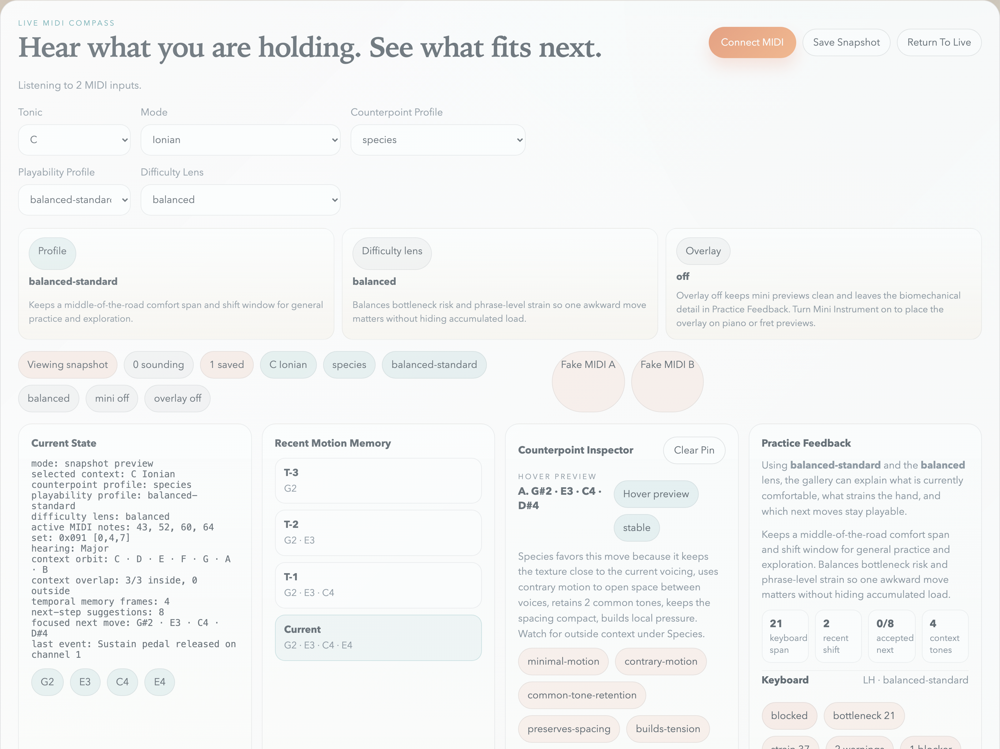
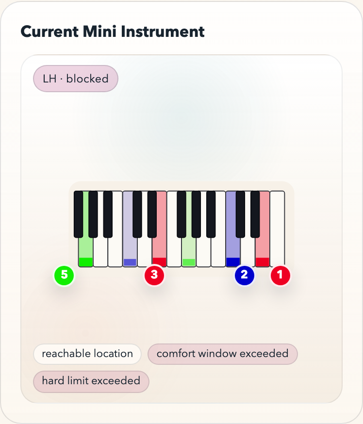
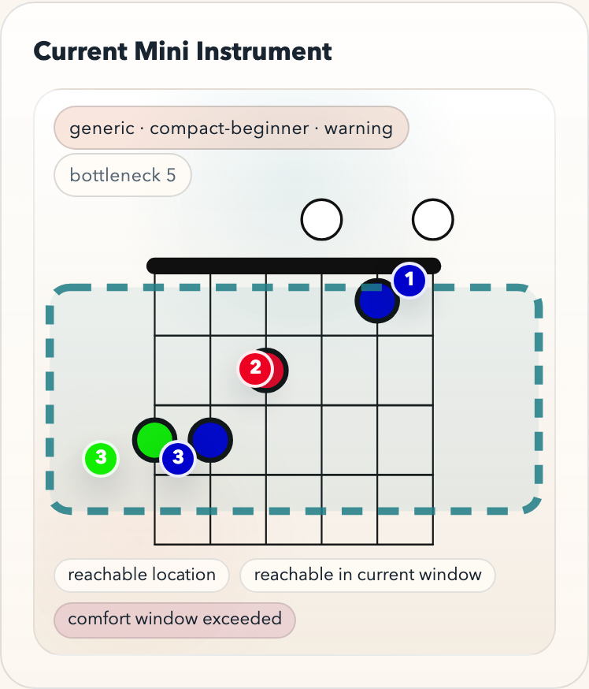

# libmusictheory

`libmusictheory` is a Zig music-theory library with a C ABI and browser/WASM surfaces.

The unified consumer-facing reference is `/Users/bermi/code/libmusictheory/docs/api.md`. Start there if you want one place that covers the stable surface, the experimental surface, task-oriented playability recipes, and the browser/WASM entry pattern.

It covers:

- pitch-class-set operations and set classification
- scales, modes, keys, note spelling, and chord naming
- harmony, roman numerals, and voice-leading helpers
- fretboard and keyboard interaction models
- SVG generation for clocks, fret diagrams, staff notation, tessellations, and related theory imagery

## Public vs Internal Surfaces

The stable public surface is intentionally smaller than the full repository.

- Stable contract:
  - `/Users/bermi/code/libmusictheory/include/libmusictheory.h`, except the APIs explicitly marked experimental in that header
  - `/Users/bermi/code/libmusictheory/src/root.zig` for source-based Zig consumers
  - `./zigw build`, `./zigw build test`, `./zigw build verify`, and `./verify.sh`
  - `./zigw build wasm-docs` as the standalone browser bundle
- Experimental public surface:
  - counterpoint state, cadence, orbifold, and next-step helpers
  - gallery policy helpers such as `lmt_mode_spelling_quality`, `lmt_rank_context_suggestions`, and `lmt_preferred_voicing_n`
  - method-specific RGBA bitmap renderers such as `lmt_bitmap_clock_optc_rgba`, `lmt_bitmap_keyboard_rgba`, and `lmt_bitmap_piano_staff_rgba`
  - `./zigw build wasm-gallery` as a supported standalone example bundle that intentionally exercises some experimental helpers
- Internal regression infrastructure:
  - `/Users/bermi/code/libmusictheory/include/libmusictheory_compat.h`
  - Harmonious parity/proof/SPA bundles:
    - `wasm-demo`
    - `wasm-scaled-render-parity`
    - `wasm-native-rgba-proof`
    - `wasm-harmonious-spa`
  - Zig namespaces used only for verification against harmoniousapp.net, such as `harmonious_svg_compat`, `bitmap_compat`, and the `svg_*_compat` modules

If you are integrating the library into your own app, start with `libmusictheory.h` or the core Zig modules. Treat the compat/proof surface as regression infrastructure, not product API.

The authoritative stable / experimental / internal classification lives in `/Users/bermi/code/libmusictheory/docs/release/stability-matrix.md`.

The internal regression infrastructure is documented separately in `/Users/bermi/code/libmusictheory/docs/internal/harmonious-regression.md`.

## Stable API Contract

This repository now has an explicit stable public surface. The authoritative inventory is `/Users/bermi/code/libmusictheory/docs/release/stability-matrix.md`.

In short:

- stable:
  - scalar theory functions such as `lmt_pcs_*`, `lmt_scale`, `lmt_mode`, `lmt_chord`, `lmt_evenness_distance`
  - public string helpers such as `lmt_spell_note`, `lmt_chord_name`, `lmt_roman_numeral`
  - public fretboard helpers such as `lmt_fret_to_midi_n`, `lmt_midi_to_fret_positions_n`, `lmt_generate_voicings_n`, `lmt_pitch_class_guide_n`, `lmt_frets_to_url_n`, `lmt_url_to_frets_n`
  - public SVG helpers such as `lmt_svg_clock_optc`, `lmt_svg_optic_k_group`, `lmt_svg_evenness_chart`, `lmt_svg_evenness_field`, `lmt_svg_fret`, `lmt_svg_fret_n`, `lmt_svg_chord_staff`, `lmt_svg_key_staff`, `lmt_svg_piano_staff`, `lmt_svg_keyboard`
- experimental:
  - counterpoint state/ranking/orbifold helpers
  - gallery policy helpers such as `lmt_mode_spelling_quality`, `lmt_rank_context_suggestions`, and `lmt_preferred_voicing_n`
  - direct RGBA bitmap renderers
- internal:
  - everything declared only in `/Users/bermi/code/libmusictheory/include/libmusictheory_compat.h`
  - all exact harmoniousapp.net parity/proof helpers
  - internal browser verification bundles and the Harmonious SPA shell

Return-value rules are explicit:

- scalar theory functions return computed values directly
- count-returning APIs such as `lmt_pcs_to_list`, `lmt_midi_to_fret_positions_n`, `lmt_pitch_class_guide_n`, and `lmt_url_to_frets_n` return the logical row/count result, even if you pass a smaller output buffer
- SVG writers such as `lmt_svg_clock_optc`, `lmt_svg_evenness_chart`, `lmt_svg_evenness_field`, `lmt_svg_fret`, `lmt_svg_fret_n`, `lmt_svg_chord_staff`, and `lmt_svg_key_staff` return the total SVG byte length required; pass `buf = NULL` and `buf_size = 0` to size the buffer first
- `lmt_frets_to_url_n` returns the bytes actually written and requires a caller buffer up front
- experimental raster writers return `0` on disabled-backend, invalid-input, or insufficient-buffer cases
- experimental fret helpers such as `lmt_preferred_voicing_n` return `0` on invalid-input, no-result, or insufficient-buffer cases

## Memory And Lifetime

- No heap ownership is transferred to callers for the stable C ABI.
- Caller-owned output buffers are required for:
  - list outputs
  - fret-position outputs
  - guide-dot outputs
  - URL serialization
  - SVG serialization
  - experimental RGBA output
- String-returning APIs such as `lmt_spell_note`, `lmt_chord_name`, and `lmt_roman_numeral` return pointers to shared internal rotating storage.
  - Copy the string if you need to keep it.
  - Do not free it.
  - Do not assume it survives another string-returning call.
  - Do not treat it as thread-safe shared state.
- Core theory algorithms are written to avoid allocation-heavy embedding patterns. For consumers, the safe assumption is that all durable output memory is owned by the caller.

## Recommended Clone-To-Review Path

If you want one obvious path from clone to confidence, use this order:

1. `./verify.sh`
2. `./zigw build wasm-docs`
3. `./zigw build wasm-gallery`

Interpretation:

- `./verify.sh` is the source-of-truth gate for the repo
- `wasm-docs` is the stable browser contract demonstration
- `wasm-gallery` is a supported standalone example surface that uses stable public SVG APIs plus experimental counterpoint and bitmap helpers

On macOS arm64, use `/Users/bermi/code/libmusictheory/zigw` instead of a raw `zig` binary. The wrapper pins a working Zig `0.15.x` toolchain for this repo and avoids the host-side `zig build` linker failure that affects this machine.

## Quickstart (C ABI)

Build the native artifacts:

```bash
cd /Users/bermi/code/libmusictheory
./zigw build
```

The installed outputs land under:

- `/Users/bermi/code/libmusictheory/zig-out/include`
- `/Users/bermi/code/libmusictheory/zig-out/lib`

Minimal example:

```c
#include "libmusictheory.h"

#include <stdio.h>

int main(void) {
    const lmt_pitch_class triad[3] = {0, 4, 7};
    lmt_pitch_class_set set = lmt_pcs_from_list(triad, 3);

    char svg[4096];
    unsigned svg_len = lmt_svg_clock_optc(set, svg, sizeof(svg));

    printf("pcs=0x%03x chord=%s svg_bytes=%u\n",
           set,
           lmt_chord_name(set),
           svg_len);
    return 0;
}
```

Compile against the installed header and library from `zig-out`.

## Quickstart (Zig)

Today the simplest Zig integration is source-based. Add the module from a checkout or vendored copy:

```zig
const libmusictheory = b.addModule("libmusictheory", .{
    .root_source_file = b.path("../libmusictheory/src/root.zig"),
    .target = target,
    .optimize = optimize,
});
```

Use it from Zig:

```zig
const std = @import("std");
const lmt = @import("libmusictheory");

pub fn main() !void {
    const set = lmt.pitch_class_set.fromList(&.{ 0, 4, 7 });
    const prime = lmt.set_class.primeForm(set);
    std.debug.print("set=0x{x} prime=0x{x}\n", .{ set, prime });
}
```

The stable Zig-facing namespaces are the core theory and rendering modules exported from `/Users/bermi/code/libmusictheory/src/root.zig`. Internal compat namespaces remain available in source, but they are not the standalone contract.

## Quickstart (Browser/WASM)

The public browser-facing entries today are the standalone docs bundle and the standalone gallery bundle.

Start with the docs bundle if you want the stable browser contract demonstration. Use the gallery when you want the supported exploratory/example surface.

```bash
cd /Users/bermi/code/libmusictheory
./zigw build wasm-docs
python3 -m http.server --directory /Users/bermi/code/libmusictheory/zig-out/wasm-docs 8001
```

Open [http://localhost:8001/index.html](http://localhost:8001/index.html).

The docs bundle now includes a `Playability And Practice APIs` section that demonstrates:

- applying a named hand-profile preset
- summarizing keyboard realization and transition difficulty
- suggesting an easier fingering for the same notes
- choosing a safer next step from a theory-valid history state

It also includes a `Phrase Audit And Host Adoption APIs` section that demonstrates:

- audit-only phrase analysis for fixed realized events
- preview versus commit, with preview remaining host-only
- committed phrase memory bias for later ranking
- realization-only repair requests
- music-changing repair requests that are labeled as such

For a single-image QA atlas covering the stable public image methods rendered by the docs bundle:

```bash
cd /Users/bermi/code/libmusictheory
./zigw build wasm-docs
python3 -m http.server --directory /Users/bermi/code/libmusictheory/zig-out/wasm-docs 8001
```

Open [http://localhost:8001/qa-atlas.html](http://localhost:8001/qa-atlas.html).

The QA atlas is a review instrument for the experimental direct bitmap companions to the stable SVG image methods. Its enforced docs-side drift threshold is currently `0.005`; that makes it a strong regression bar, but not a stable `1:1` bitmap contract.

For the standalone gallery bundle, which is a supported standalone example surface and uses stable public SVG APIs plus experimental counterpoint and bitmap helpers:

```bash
cd /Users/bermi/code/libmusictheory
./zigw build wasm-gallery
python3 -m http.server --directory /Users/bermi/code/libmusictheory/zig-out/wasm-gallery 8002
```

Open [http://localhost:8002/index.html](http://localhost:8002/index.html).

## Gallery Scenes

The standalone gallery is intentionally curated around concrete musical-discovery workflows:

- `Live MIDI Compass`: listen to all browser MIDI inputs, honor sustain, choose the tonic/mode lens explicitly, save snapshots with the middle pedal, and see compatible next-note suggestions over colored pitch-class diagrams, live `OPTIC/K` grouping, live evenness field focus, keyboard highlights, treble/bass/grand staff rendering, voice-leading horizon/braid, counterpoint weather/risk, cadence funnel, and suspension-state guidance in real time
- `Set Observatory`: inspect a pitch-class set as a constellation with prime-form, complement, inversion, `OPTIC/K` complement-pair context, and a focused evenness field
- `Key Bloom`: watch one tonic generate a full diatonic orbit and its triadic degree field
- `Chord Atelier`: read one sonority simultaneously as set, chord label, roman numeral, clock, and staff image
- `Progression Drift`: treat cadences as moving set-fields and track shared tones across a progression
- `Constellation Delta`: compare two pitch-class worlds by overlap, union, and transpositional relation
- `Fret Atlas`: explore the same pitch logic across arbitrary tunings and string counts

These scenes are driven by the authored preset manifest at `/Users/bermi/code/libmusictheory/examples/wasm-gallery/gallery-presets.json`.

For the live MIDI scene, run the gallery in a Chromium-family browser with Web MIDI enabled on `localhost` or `https:`. Sustain (`CC64`) is tracked as sounding state, the selected tonic/mode drives spelling quality and next-step suggestion ranking through experimental library helpers, and middle pedal / sostenuto (`CC66`) stores clickable snapshots that restore both notes and context. The gallery also exposes a global preview-mode toggle so every large visualization can switch between SVG large vector previews and direct RGBA bitmap previews rendered by the library itself.

The gallery bundle is a supported standalone example surface, but its live counterpoint engine and direct bitmap preview helpers are still experimental APIs rather than the stable embedding contract.

The gallery preview toggle is also an experimental proof tool. It compares large SVG previews against direct library bitmap previews with a bundle-level drift threshold of `0.07` on the critical set/context hosts. Treat that as coherence validation for the example surface, not as a stable promise of exact SVG-vs-bitmap parity.

## Playability Gallery States

The repo also keeps a small deterministic screenshot set for the new playability-focused gallery states. These are captured from the public `wasm-gallery` surface, not mocked up separately.



Caption: the default `balanced-standard` + `balanced` state keeps overlays off, surfaces the live playability guide cards, and leaves the extra detail in the practice-feedback panel.



Caption: `compact-beginner` + `minimax-bottleneck` on `Piano` with the `Basic` overlay puts finger markers and blocked or warning chips directly on the keyboard mini preview.



Caption: the `Fret` mini preview with the `Detailed` overlay adds hand-box geometry and richer warning context so a practice tool or LLM can explain why a continuation is awkward.

## Release Readiness

The standalone release scaffold is documented here:

- `/Users/bermi/code/libmusictheory/RELEASE_CHECKLIST.md`
- `/Users/bermi/code/libmusictheory/docs/release/artifacts.md`
- `/Users/bermi/code/libmusictheory/docs/release/gallery-capture.md`
- `/Users/bermi/code/libmusictheory/docs/release/image-review-matrix.md`
- `/Users/bermi/code/libmusictheory/docs/release/reviewer-guide.md`
- `/Users/bermi/code/libmusictheory/docs/release/smoke-matrix.md`
- `/Users/bermi/code/libmusictheory/docs/release/stability-matrix.md`
- `/Users/bermi/code/libmusictheory/docs/release/versioning.md`

To run the standalone release smoke path directly:

```bash
cd /Users/bermi/code/libmusictheory
./scripts/release_smoke.sh
```

This smoke path validates only the standalone surfaces: native build, C ABI smoke, `wasm-docs`, and `wasm-gallery`.

To regenerate the release-candidate gallery screenshots locally:

```bash
cd /Users/bermi/code/libmusictheory
node /Users/bermi/code/libmusictheory/scripts/capture_wasm_gallery_screenshots.mjs
```

This writes deterministic captures to `/Users/bermi/code/libmusictheory/zig-out/wasm-gallery-captures/`.

To regenerate the standalone docs QA atlas image locally:

```bash
cd /Users/bermi/code/libmusictheory
node /Users/bermi/code/libmusictheory/scripts/capture_wasm_docs_qa_atlas.mjs
```

This writes a single review image and summary to `/Users/bermi/code/libmusictheory/zig-out/wasm-docs-qa/`.
The atlas rows are PNGs encoded from RGBA buffers returned by the library, not browser-rasterized SVG previews.

If you want to call exports directly from JavaScript, start with scalar APIs that do not require manual buffer setup:

```html
<script type="module">
  const { instance } = await WebAssembly.instantiateStreaming(fetch("/libmusictheory.wasm"), {});
  const { lmt_scale, lmt_mode } = instance.exports;

  console.log("C diatonic scale pcs =", lmt_scale(0, 0).toString(16));
  console.log("C dorian pcs =", lmt_mode(1, 0).toString(16));
</script>
```

Low-level browser buffer management is still evolving. The standalone contract today is the exported functions in `libmusictheory.h` plus the `wasm-docs` bundle, not the internal Harmonious scratch helpers.

## Further Reading

- `/Users/bermi/code/libmusictheory/docs/research/`
- `/Users/bermi/code/libmusictheory/docs/architecture/graphs.md`
