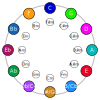

# Circle of Fifths and Key Signature Graphs

## Methods

- `src/svg/circle_of_fifths.zig:12` `fifthsOrder`
- `src/svg/circle_of_fifths.zig:16` `renderCircleOfFifths`
- `src/svg/key_sig.zig:8` `renderKeySignature`

## Current Approach

- Fully algorithmic ring placement for fifths order and key labels.
- Deterministic geometry from pitch-class arithmetic and key signature rules.
- Minimal dependency on generated static payloads.

## Alternative Programmatic Approaches Studied

- Polar chart libraries for categorical circular domains.
- Constraint-based label placement with overlap solvers.
- Declarative chart grammars for thematic style layers.

Decision:

- Keep custom Zig implementation for deterministic output and compact binary size.

## Swappable Backend Plan

IR blocks:

- `CircularAxis`, `KeyNode`, `FifthsEdge`, `SignatureMark`

Backend mapping:

- SVG backend for publication/static docs.
- Bitmap backend for animated traversal (modulation paths, key transitions).

## Path to Fully Algorithmic

1. Keep as algorithmic baseline for backend abstraction tests.
2. Add label-overlap strategies as optional layout policy modules.
3. Reuse circular axis primitives for additional harmonic cycle graphs.

## Samples

- 
