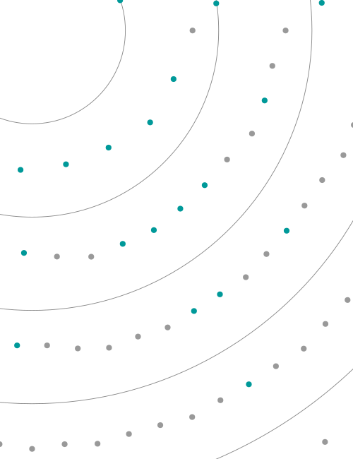
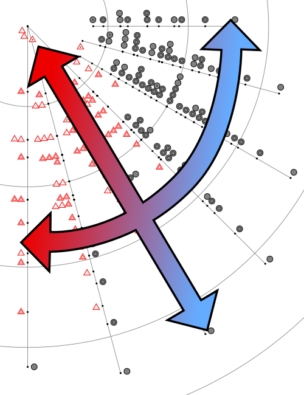

# Evenness Graphs

## Methods

- `src/svg/evenness_chart.zig:19` `computeDots`
- `src/svg/evenness_chart.zig:58` `renderEvennessChart`
- `src/svg/evenness_chart.zig:85` `renderEvennessByName` (compat `even/index|line|grad`)

## Current Approach

- Dot coordinates are computed algorithmically from set cardinality and normalized evenness distance.
- Compatibility named outputs (`index`, `line`, `grad`) currently decode compressed payloads from `src/generated/harmonious_even_gzip.zig` for exact historical parity.

## Alternative Programmatic Approaches Studied

- Scatter/radial charts in Vega-Lite/Plotly-like pipelines.
- Force-relaxed placement by cardinality class with collision constraints.
- Multi-scale density maps over set-class metrics.

Decision:

- Keep deterministic analytical placement in Zig.
- Replace compressed compat payloads with generated style/theme pipeline.

## Swappable Backend Plan

IR blocks:

- `RingGuide`, `DotSet`, `LegendLabel`, `ClusterStateStyle`

Backend mapping:

- SVG backend for static docs and compatibility checks.
- Bitmap backend for interactive density overlays and animation.

## Path to Fully Algorithmic

1. Rebuild `even/index`, `even/line`, `even/grad` from style parameters over shared geometry model.
2. Eliminate gzip payload dependency while preserving byte-stable serializer policy where needed.
3. Use analytic style generators for gradients/line families.

## Samples

- 
- 
