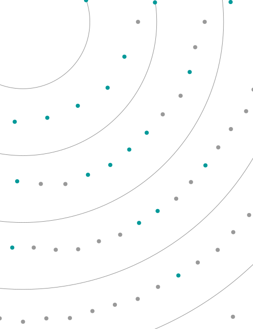
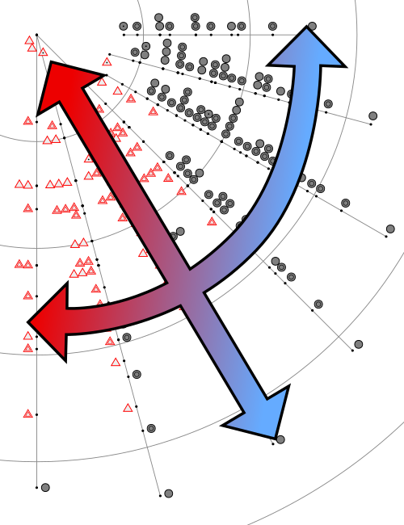

# Evenness Graphs

## Methods

- `src/svg/evenness_chart.zig:19` `computeDots`
- `src/svg/evenness_chart.zig:58` `renderEvennessChart`
- `src/svg/evenness_chart.zig:85` `renderEvennessByName` (compat `even/index|line|grad`)
- `src/even_compat_model.zig:1` recovered display-domain and marker-family rules for
  the historical compat chart

## Current Approach

- Dot coordinates are computed algorithmically from set cardinality and normalized evenness distance.
- Compatibility named outputs (`index`, `line`, `grad`) currently decode segmented XZ
  payloads from `src/generated/harmonious_even_segment_xz.zig` for exact historical parity.
- The chart domain is no longer a black box:
  - all OPTIC representatives are retained except `14` symmetric hexachords,
  - `C=6` keeps only the `6` self-complementary symmetric hexachords,
  - index marker families follow recovered scale-family subset rules from the original
    Harmonious tutorial text.

## Alternative Programmatic Approaches Studied

- Scatter/radial charts in Vega-Lite/Plotly-like pipelines.
- Force-relaxed placement by cardinality class with collision constraints.
- Multi-scale density maps over set-class metrics.

Decision:

- Keep deterministic analytical placement in Zig.
- Replace compressed compat payloads with generated style/theme pipeline.

## Swappable Backend Plan

IR blocks:

- `RingGuide`, `DotSet`, `LegendLabel`, `ClusterStateStyle`

Backend mapping:

- SVG backend for static docs and compatibility checks.
- Bitmap backend for interactive density overlays and animation.

## Path to Fully Algorithmic

1. Rebuild `even/index`, `even/line`, `even/grad` from style parameters over the
   recovered display-domain model in `src/even_compat_model.zig`.
2. Replace the remaining payload-backed marker placement and per-variant decoration
   blocks with deterministic geometry rules.
3. Eliminate the segmented XZ dependency while preserving byte-stable serializer
   policy where exact SVG parity still matters.
4. Use the same display-domain model for direct native-RGBA proof rendering.

## Samples

- 
- 
