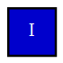

# Mode Icon Graphs (OC Family)

## Methods

- `src/svg/mode_icon.zig:32` `renderModeIcon`
- `src/harmonious_svg_compat.zig:212` `renderModeIcon` (compat route for `oc/*`)

## Current Approach

- Core mode icons are generated algorithmically from `ModeIconSpec`:
- family (`diatonic`, `acoustic`, `diminished`, `whole_tone`)
- transposition
- degree
- Compatibility `oc/*` rendering still uses template body substitution from `src/generated/harmonious_oc_templates.zig` to preserve historical shape/text details.

## Alternative Programmatic Approaches Studied

- Procedural icon generation in Canvas/SVG from degree/state symbols.
- Symbol atlases (font or SDF glyph sets) for compact label/icon rendering.
- Layered vector token systems (primitive grammar + style theme).

Decision:

- Move toward primitive tokenized icon composition; keep template route only as temporary parity bridge.

## Swappable Backend Plan

IR blocks:

- `IconFrame`, `FillRegion`, `RomanLabel`, `AccentMark`

Backend mapping:

- SVG backend: path/rect/text serialization.
- Bitmap backend: fill/stroke/text raster pass with deterministic baseline metrics.

## Path to Fully Algorithmic

1. Decompose OC templates into primitives (frame + degree glyph + color state).
2. Replace template string replacement with symbol composition.
3. Maintain strict ordering/format rules for compat outputs.

## Samples

- 
- 
