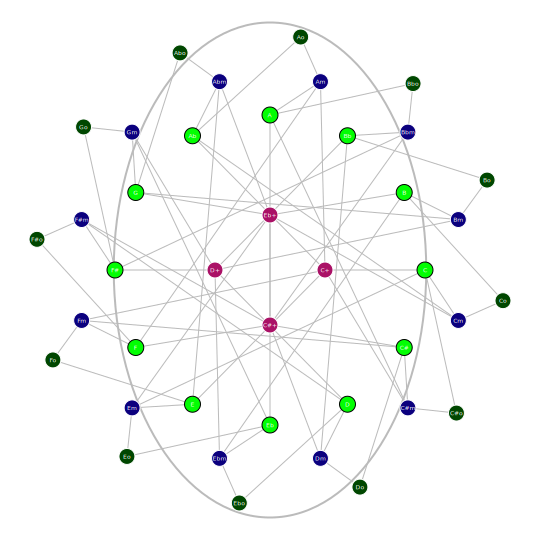

# Orbifold Graphs

## Methods

- `src/svg/orbifold.zig:30` `enumerateTriadNodes`
- `src/svg/orbifold.zig:61` `buildTriadEdges`
- `src/svg/orbifold.zig:83` `renderTriadOrbifold`

## Current Approach

- Fully algorithmic node and edge generation for triad relations.
- Deterministic placement and serialization from theory-derived node set.
- No compressed replay payload in the main orbifold renderer path.

## Alternative Programmatic Approaches Studied

- Force-directed layout with stabilized seeds.
- Spectral graph embeddings for relation distance preservation.
- Edge-bundled layered graph visualizations for dense transformation paths.

Decision:

- Preserve deterministic analytical placement for reproducibility and testing.
- Add optional derived overlays (cost contours, transformation classes) via IR layers.

## Swappable Backend Plan

IR blocks:

- `OrbifoldNode`, `RelationEdge`, `ClassOverlay`, `AxisGuide`

Backend mapping:

- SVG backend for deterministic static diagrams.
- Bitmap backend for continuous zoom/pan in plugin/mobile contexts.

## Path to Fully Algorithmic

1. Keep orbifold renderer as reference implementation for IR-first generation.
2. Move serializer details to backend adapters.
3. Reuse orbifold IR conventions for future harmony network graphs.

## Samples

- 
