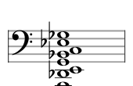
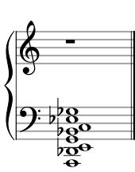

# Staff Graphs (Scale / Chord / Grand Chord)

## Methods

- Core staff renderer: `src/svg/staff.zig`
- Compatibility renderers:
- `src/svg/chord_compat.zig`
- `src/svg/scale_nomod_compat.zig`
- Compatibility entry routing: `src/harmonious_svg_compat.zig`

Kinds covered:

- `scale`, `chord`, `grand-chord`, `chord-clipped`, `wide-chord`

## Current Approach

- Compatibility-first deterministic emitters for exact harmoniousapp parity.
- Note parsing, key signature logic, and base layout are algorithmic.
- Remaining parity support includes compact patch/shim datasets for historical numeric/string edge cases.

## Alternative Programmatic Approaches Studied

- VexFlow-style stave/note layout pipeline.
- Verovio/MEI engraving strategies for canonical notation spacing.
- abcjs parsing + render staging for compact symbolic input.

Decision:

- Keep custom Zig layout for deterministic parity and wasm footprint control.
- Use engraving engines only as research references, not runtime dependencies.

## Swappable Backend Plan

IR layers:

- `StaffSystem` (lines, clef, key signature)
- `NoteGlyph` (head, stem, accidental, ledger)
- `LabelRun` (optional text)

Backend mapping:

- SVG backend emits canonical path/text order.
- Bitmap backend paints glyph outlines and lines from same IR.

## Path to Fully Algorithmic

1. Remove remaining per-case patch/shim dependencies in chord/scale compat paths.
2. Model accidental placement and collision as rule-based solver only.
3. Keep parity fixtures to validate serializer/output identity while reducing data tables.

## Samples

- 
- 
- 
