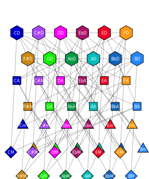

# Tessellation and Majmin Graphs

## Methods

- Core tessellation:
- `src/svg/tessellation.zig:54` `enumerateTiles`
- `src/svg/tessellation.zig:77` `buildAdjacency`
- `src/svg/tessellation.zig:112` `renderScaleTessellation`
- Compatibility majmin:
- `src/svg/majmin_compat.zig:321` `render`

Kinds covered:

- `majmin/modes`, `majmin/scales`

## Current Approach

- Core tessellation map is algorithmically generated from tile geometry and adjacency rules.
- Majmin compatibility output currently reconstructs SVG from packed compressed templates/offset streams (`src/generated/harmonious_majmin_compat_xz.zig`) for exact parity.

## Alternative Programmatic Approaches Studied

- Polygon tiling engines with procedural adjacency maps.
- Graph drawing pipelines (radial/hypergraph overlays) with deterministic node routing.
- Declarative scene grammar + style resolver (template-free).

Decision:

- Keep algorithmic tessellation as canonical layout source.
- Replace majmin packed reconstruction with rule-based scene composition over shared tessellation graph.

## Swappable Backend Plan

IR blocks:

- `TilePolygon`, `AdjacencyEdge`, `SelectionLayer`, `Annotation`, `LinkAnchor`

Backend mapping:

- SVG backend for exact comparability and docs.
- Bitmap backend for high-density interaction (hover masks, hit regions, animation states).

## Path to Fully Algorithmic

1. Extract majmin topology rules from packed templates into explicit graph/layout rules.
2. Generate tile/link/style layers from data model rather than packed text payload.
3. Keep parity snapshots as regression fixtures while removing packed source dependency.

## Samples

- 
