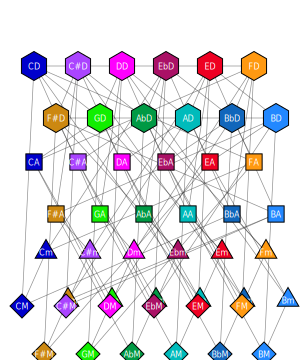

# Tessellation and Majmin Graphs

## Methods

- Core tessellation:
- `src/svg/tessellation.zig:54` `enumerateTiles`
- `src/svg/tessellation.zig:77` `buildAdjacency`
- `src/svg/tessellation.zig:112` `renderScaleTessellation`
- Compatibility majmin:
- `src/svg/majmin_compat.zig:768` `render`

Kinds covered:

- `majmin/modes`, `majmin/scales`

## Current Approach

- Core tessellation map is algorithmically generated from tile geometry and adjacency rules.
- Majmin compatibility output now reconstructs SVG from a compact scene pack (`src/generated/harmonious_majmin_scene_pack_xz.zig`) using:
- grouped `modes` transposition remaps (`family + rotation`),
- family-based `scales` transposition remaps,
- shared skeleton/style/href/path template primitives,
- raw legacy overview payloads for the two historical overview variants per kind.

## Alternative Programmatic Approaches Studied

- Polygon tiling engines with procedural adjacency maps.
- Graph drawing pipelines (radial/hypergraph overlays) with deterministic node routing.
- Declarative scene grammar + style resolver (template-free).

Decision:

- Keep algorithmic tessellation as canonical layout source.
- Use deterministic scene composition over grouped transposition/family rules for strict majmin byte parity.

## Swappable Backend Plan

IR blocks:

- `TilePolygon`, `AdjacencyEdge`, `SelectionLayer`, `Annotation`, `LinkAnchor`

Backend mapping:

- SVG backend for exact comparability and docs.
- Bitmap backend for high-density interaction (hover masks, hit regions, animation states).

## Path to Fully Algorithmic

1. Replace scene-pack path remap payload with computed link/path placement rules.
2. Generate tile/link/style layers from the tessellation data model rather than packed skeleton templates.
3. Keep strict parity fixtures while progressively deleting scene-pack primitive tables.

## Samples

- 
